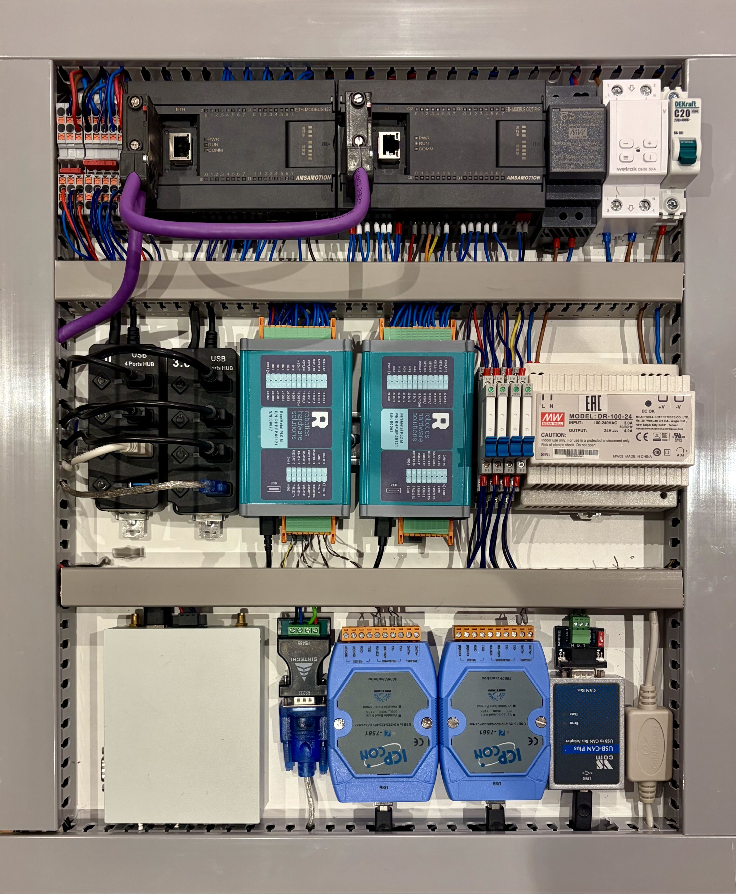

## Hardware-in-the-Loop Test Bench 
Special Stand for CI/CD tests [RHS-BareMetalCore](https://github.com/RoboticsHardwareSolutions/RHS-BareMetalCore) and [BMPLC_Quick_Project](https://github.com/RoboticsHardwareSolutions/BMPLC_Quick_Project)

Consists hardware for connect to all PLC IO and all PLC interfaces (RS485/RS232/RS422/CAN/Ethernet)

